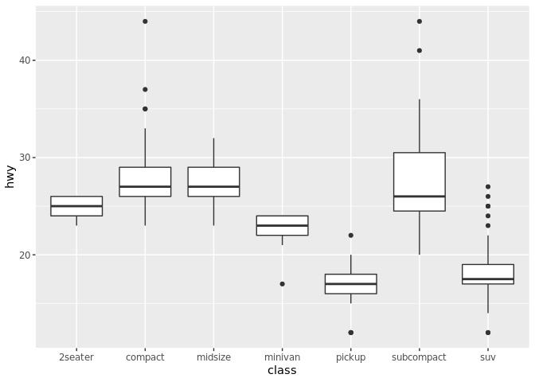
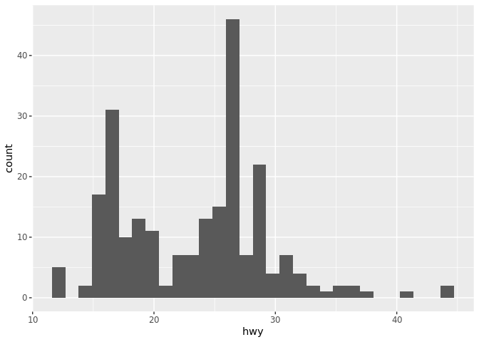
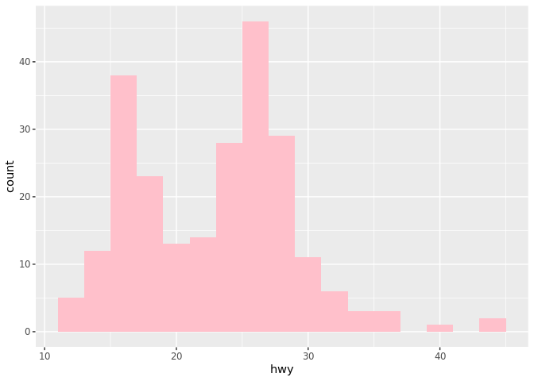
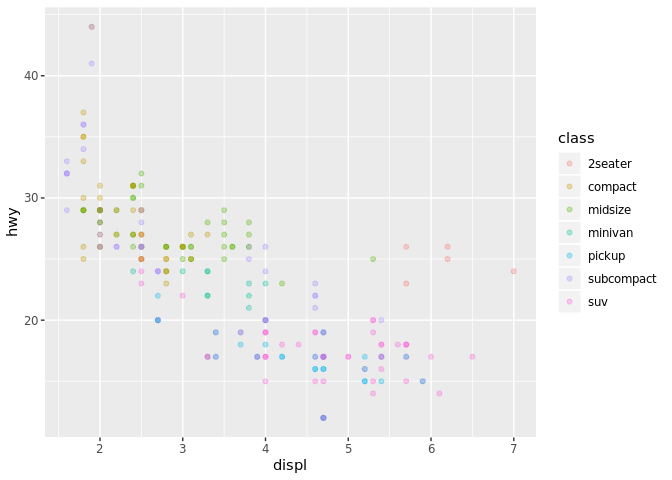
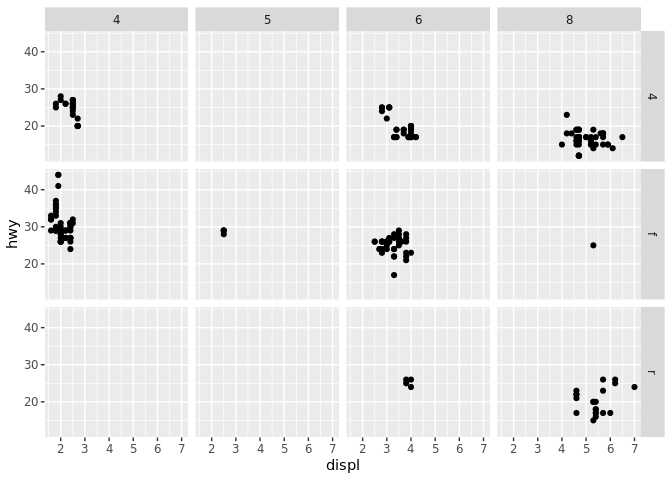
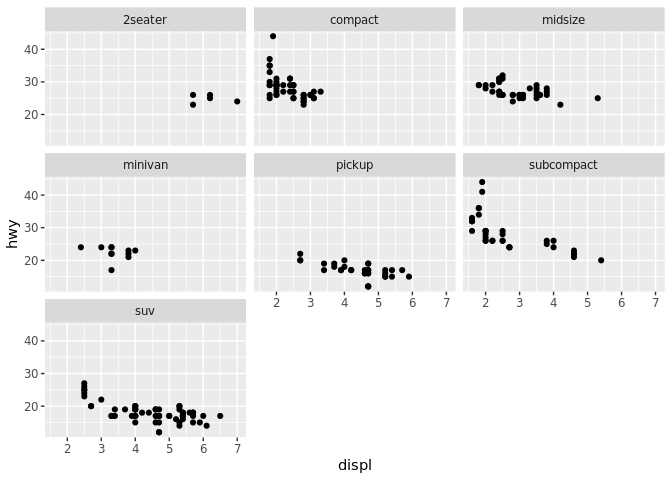

Visualize Data
================

``` r
mpg
```

    ## # A tibble: 234 x 11
    ##    manufacturer model displ  year   cyl trans drv     cty   hwy fl    class
    ##    <chr>        <chr> <dbl> <int> <int> <chr> <chr> <int> <int> <chr> <chr>
    ##  1 audi         a4      1.8  1999     4 auto… f        18    29 p     comp…
    ##  2 audi         a4      1.8  1999     4 manu… f        21    29 p     comp…
    ##  3 audi         a4      2    2008     4 manu… f        20    31 p     comp…
    ##  4 audi         a4      2    2008     4 auto… f        21    30 p     comp…
    ##  5 audi         a4      2.8  1999     6 auto… f        16    26 p     comp…
    ##  6 audi         a4      2.8  1999     6 manu… f        18    26 p     comp…
    ##  7 audi         a4      3.1  2008     6 auto… f        18    27 p     comp…
    ##  8 audi         a4 q…   1.8  1999     4 manu… 4        18    26 p     comp…
    ##  9 audi         a4 q…   1.8  1999     4 auto… 4        16    25 p     comp…
    ## 10 audi         a4 q…   2    2008     4 manu… 4        20    28 p     comp…
    ## # … with 224 more rows

Your Turn 1
-----------

Run the code on the slide to make a graph. Pay strict attention to spelling, capitalization, and parentheses! can add any notes in the your turn. put the code into the chunk. ggplot2 not working so we forced an update the first part initializes the graphic after each + it is adding a new layer (always put + at the end of the line not the beginning of the next) the geom\_point is adding the points and aes(aesthetics) is telling it what to put where every plot starts with this bare template(not including mpg, point, and displ and hwy) first decision is what is the geom(etries) ours was point

``` r
ggplot(data = mpg) + 
  geom_point(mapping = aes(x = displ, y = hwy))
```


Your Turn 2
-----------

Replace this scatterplot with one that draws boxplots. Use the cheatsheet. Try your best guess. I just replaced point with the word boxplot

``` r
ggplot(data = mpg) +
  geom_boxplot(mapping = aes(x = class, y = hwy))
```



Your Turn 3
-----------

Make a histogram of the `hwy` variable from `mpg`. Hint: do not supply a y variable. don't have to write mapping, can just write aes = ... we want a different binwidth so we can find how to change it by going to help-&gt; and typing geom\_histogram and looking for codes

``` r
ggplot(data = mpg) +
  geom_histogram(mapping = aes(x = hwy))
```

    ## `stat_bin()` using `bins = 30`. Pick better value with `binwidth`.



Your Turn 4
-----------

Use the help page for `geom_histogram` to make the bins 2 units wide. inside aes is the values; outside it all the aesthetics we want to change type the color in quotes

``` r
ggplot(data = mpg) +
  geom_histogram(mapping = aes(x = hwy), binwidth = 2, fill = "pink")
```



Your Turn 5
-----------

Add `color`, `size`, `alpha`, and `shape` aesthetics to your graph. Experiment. changing aesthetics is to draw peoples eyes to what we want them to notice shape only has 6 XD alpha changes transparency outside the aes applies to everything anything with one particular variable has to be inside aes

``` r
ggplot(data = mpg) +
  geom_point(mapping = aes(x = displ, y = hwy, color = class), alpha = 0.3)  
```



Help Me
-------

What do `facet_grid()` and `facet_wrap()` do? (run the code, interpret, convince your group)

``` r
# Makes a plot that the commands below will modify
q <- ggplot(mpg) + geom_point(aes(x = displ, y = hwy))

q + facet_grid(. ~ cyl)
```


``` r
q + facet_grid(drv ~ .)
```


``` r
q + facet_grid(drv ~ cyl)
```



``` r
q + facet_wrap(~ class)
```



Your Turn 6
-----------

Make a bar chart `class` colored by `class`. Use the help page for `geom_bar` to choose a "color" aesthetic for class.

Quiz
----

What will this code do?

``` r
ggplot(mpg) + 
  geom_point(aes(displ, hwy)) +
  geom_smooth(aes(displ, hwy))
```

    ## `geom_smooth()` using method = 'loess' and formula 'y ~ x'


------------------------------------------------------------------------

Take aways
==========

You can use this code template to make thousands of graphs with **ggplot2**.

``` r
ggplot(data = <DATA>) +
  <GEOM_FUNCTION>(mapping = aes(<MAPPINGS>))
```
